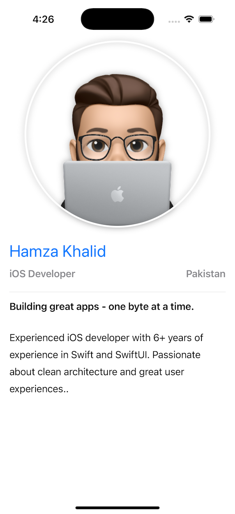

# SwiftUI-Basic

Welcome to the companion project for the articles
- [**SwiftUI Basics: Building Interfaces One View at a Time**](https://medium.com/@m-hamzak/swiftui-basics-building-interfaces-one-view-at-a-time-3c230e67e2d7).

This simple SwiftUI app demonstrates how to build a clean, responsive personal profile using SwiftUI. It's perfect for beginners looking to learn:

✅ VStack & HStack layouts  
✅ Image modifiers and shadows  
✅ Custom reusable views  
✅ Live preview system

## 💻 Preview

## 🧰 Tech Stack

- Swift 5
- SwiftUI
- Xcode 15+

